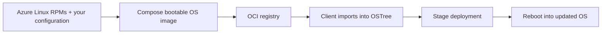

**Yes—you can build an Azure Linux derivative with Silverblue-style atomic updates and rollbacks, and distribute its OS updates through an OCI registry.** rpm-ostree already implements OCI transport through *OSTree native containers*. Azure Linux also maintains rpm-ostree packages, so there is an existing foundation. [rpm-ostree documentation](https://coreos.github.io/rpm-ostree/container/), [Azure Linux releases](https://github.com/microsoft/azurelinux/releases)

The architecture would look like this:



The OCI image delivers the operating system, including its kernel. Once deployed, the machine boots that OS normally. [Bootable container model](https://bootc.dev/bootc/)

You have two practical choices:

| Approach | Best fit |
|---|---|
| **rpm-ostree with OCI transport** | You want Silverblue-style management, including local `rpm-ostree install` package layering. |
| **bootc** | You want to build and publish all persistent OS changes as container images. |

For your stated requirements, **I would start with rpm-ostree and OCI transport**. If local package layering is unnecessary, I would evaluate bootc first: upstream development of new container features is concentrated there. Bootc currently cannot perform upgrades after certain rpm-ostree local modifications, including package layering. [Upstream direction](https://coreos.github.io/rpm-ostree/), [bootc interoperability](https://bootc.dev/bootc/relationships.html)

Once you have a working Azure Linux treefile, the upstream publishing workflow is:

```bash
rpm-ostree compose image \
  --initialize-mode=if-not-exists \
  --format=registry \
  azurelinux.yaml \
  quay.io/YOUR_ORG/azurelinux-atomic:stable
```

On an **already provisioned, compatible OSTree system**, with image signatures and a corresponding verification policy configured:

```bash
sudo rpm-ostree rebase \
  ostree-image-signed:docker://quay.io/YOUR_ORG/azurelinux-atomic:stable
sudo systemctl reboot
```

Subsequent releases use `rpm-ostree upgrade` followed by a reboot. OCI layers can be reused between releases; chunked images improve transfer efficiency, although this differs from traditional OSTree static deltas. These are upstream command examples—the Azure Linux integration still needs validation. [OCI composition and transport](https://coreos.github.io/rpm-ostree/container/)

**The substantial work is making the base image boot and update correctly.** You would need to:

- Define the Azure Linux packages, repositories, and configuration in a treefile.
- Integrate the kernel, initramfs, bootloader, and OSTree filesystem layout.
- Produce an installer or VM disk image for the initial installation.
- Verify registry updates and rollback in a VM before adding more features.

Bootable images have distribution-specific integration requirements; installing rpm-ostree into an ordinary container is only part of that work. [Image requirements](https://bootc.dev/bootc/bootc-images.html)

My suggested first milestone is a minimal Azure Linux VM that boots release A, upgrades to release B from your registry, and successfully rolls back. If you also want Silverblue’s desktop experience, GNOME, Flatpak, and hardware support would be a separate layer of work.
